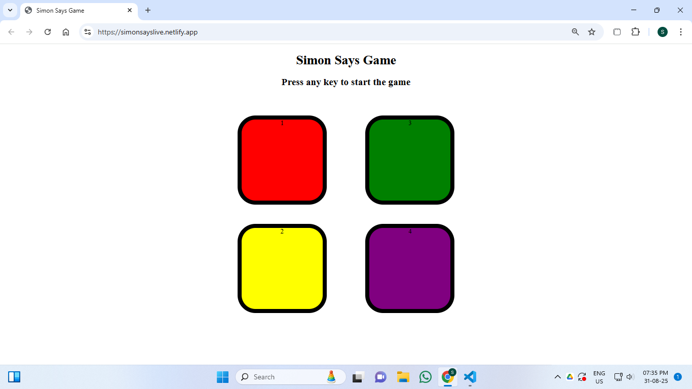
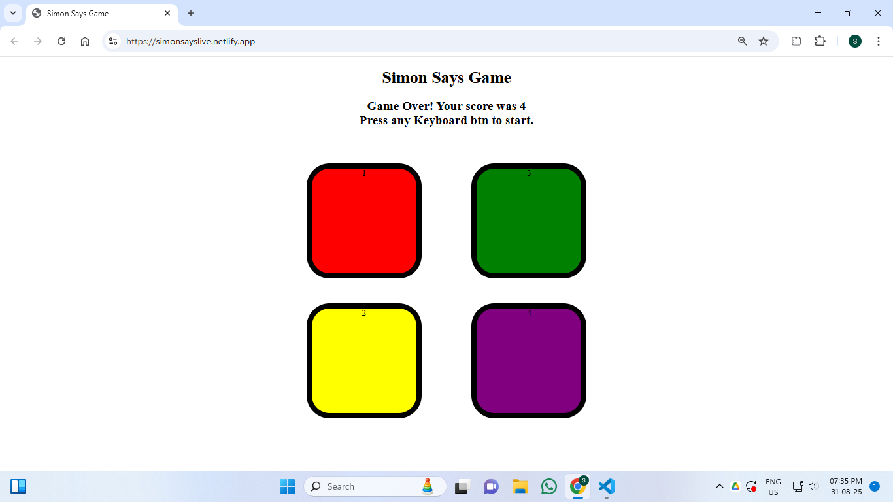

# 🎮 Simon Says Game

A fun memory game built with **HTML, CSS, and JavaScript**.  
Follow the sequence of flashes and see how far you can go!

---

## 🚀 Live Demo
👉 [Play Here](https://simonsayslive.netlify.app/)

---

## 📸 Screenshot
Game Start Screen:


Game Over Screen:


---

## 🎯 How to Play
1. Press any key to begin the game.
2. Watch carefully as one of the colored buttons flashes.
3. Repeat the sequence by clicking the same button.
4. Each new level adds **one more step** to the sequence.
5. If you make a mistake, the game will flash red and end.
6. Press any key again to restart and try to beat your high score!

---

## ✨ Features
 🔹 Four colorful buttons (Red, Yellow, Green, Purple).
 🔹 Random sequence generation each round.
 🔹 Flash animation when the game shows or you press a button.
 🔹 Score/level display updates automatically.
 🔹 Game-over feedback with flashing red screen.
 🔹 Restart option after losing.
 🔹 Works on desktop 

---

## 🛠️ Technologies Used
- **HTML5**
- **CSS3**
- **JavaScript (Vanilla JS)**

---

## 📂 Project Setup
Clone the repo and open `index.html` in your browser:
```bash
git clone https://github.com/Shankar-Sala/simon-says-game.git
cd simon-says-game
open index.html
